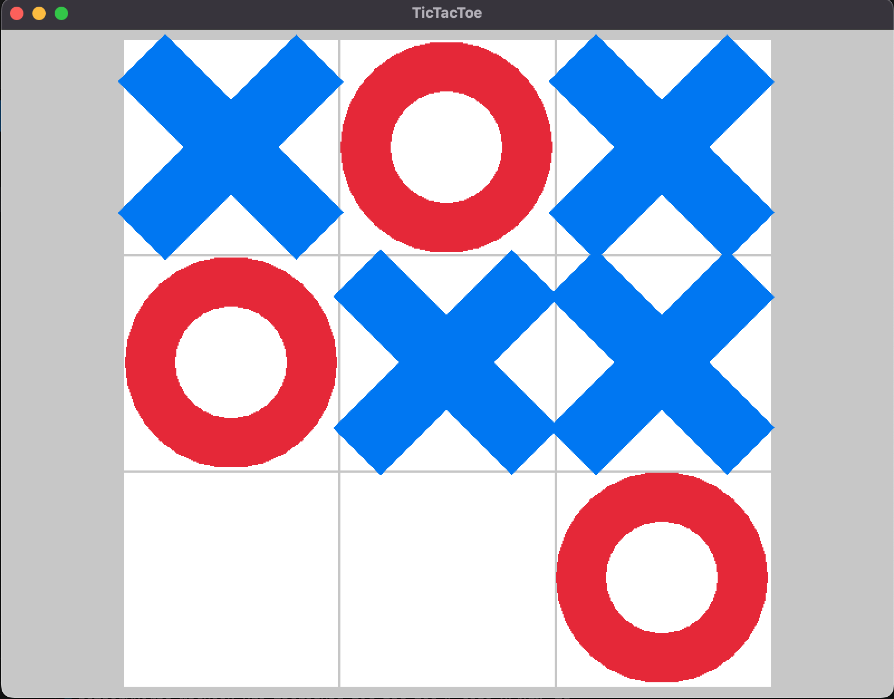

# Tic-Tac-Toe in [macroquad](https://github.com/not-fl3/macroquad)

Simple macroquad example of using `blocking_event_loop`

**!!! Currently not working: local paths in Cargo.toml**

## Tested on platforms:
- OSX (Intel)
- WASM (using [cargo-webquad](https://github.com/not-fl3/cargo-webquad/tree/master))
- Android with [this PR](https://github.com/not-fl3/miniquad/pull/449) (Additional tweaking needed for touch support, now it works weird)
- Should work on Windows and `(GNU )?Linux( (X11|Wayland))?( (GTK|QT))?` (Not tested yet)

## TODO:
- Add support for touch after `blocking_event_loop` is implemented for android and iOS (Added to macroquad localy, make PR)
- Catched bug of `draw_circle_lines` it draws lines like it's sun (fix, or create issue if lazy)
- Clarify in iOS documentation that you need to use your package name instead `mygame` everywhere (probably `cargo-quad-ios` will be convenient) (Probably add log command from [here](https://macroquad.rs/articles/ios/#simulator-logs))